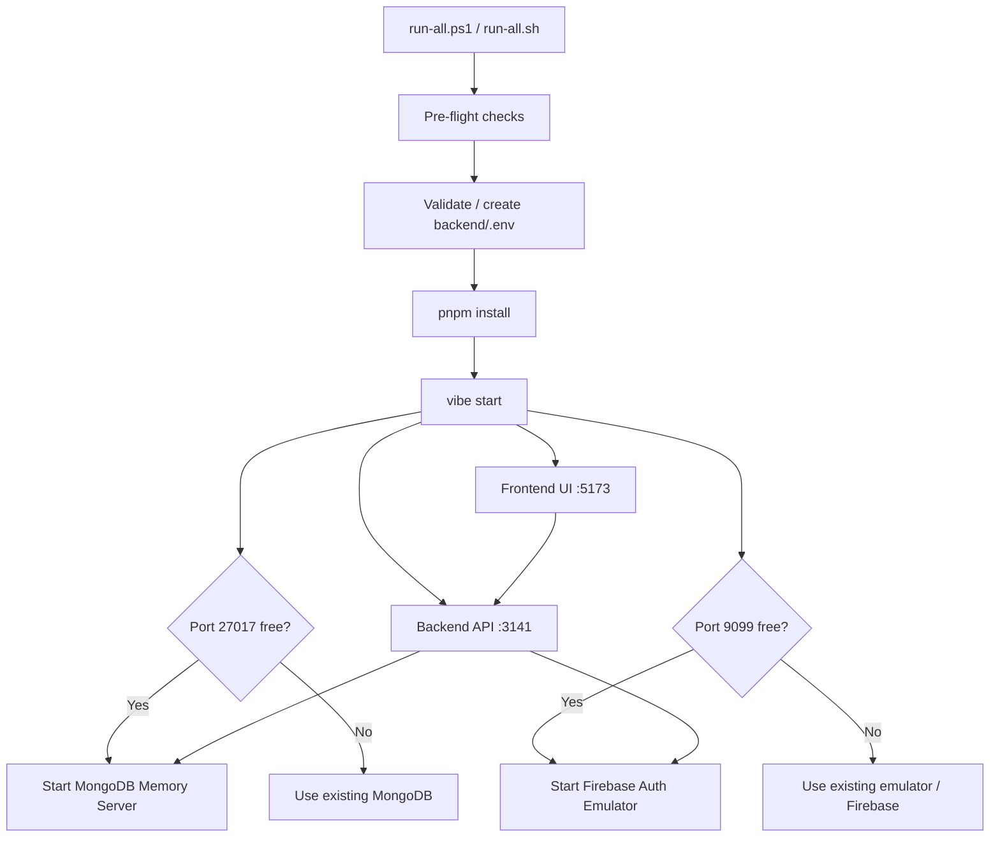

# ViBe — Local Development Guide

This guide explains how to run the ViBe project locally from a fresh clone. The entire stack — MongoDB, Firebase Auth Emulator, Backend API, and Frontend — starts with a single command.

---

## 🛠️ Prerequisites

Install the following tools **before** running the startup script. The script will check for each one and stop with a clear error if anything is missing.

| Tool | Version | Install |
|------|---------|---------|
| **Node.js** | v22.0.0 or higher | [nodejs.org](https://nodejs.org) |
| **pnpm** | Latest | `npm install -g pnpm` |
| **Java (JRE/JDK)** | 11 or higher | [adoptium.net](https://adoptium.net) |
| **Firebase CLI** | Latest | `npm install -g firebase-tools` |

> [!NOTE]
> **Why Java?** The Firebase Auth Emulator is a Java process bundled with the Firebase CLI. It handles all authentication locally — no real Firebase project or internet connection is needed for dev.

---

## ⚡ Quick Start

Clone the repository and run the startup script for your platform from the **project root**:

### Windows (PowerShell)

```powershell
git clone https://github.com/continuousactivelearning/vibe.git
cd vibe
powershell -ExecutionPolicy Bypass -File .\run-all.ps1
```

> If you already have PowerShell open inside the project directory:
> ```powershell
> ./run-all.ps1
> ```

### macOS / Linux (Bash)

```bash
git clone https://github.com/continuousactivelearning/vibe.git
cd vibe
chmod +x run-all.sh
./run-all.sh
```

The startup script does everything automatically:

1. ✅ Validates prerequisites (Node.js, pnpm, Java, Firebase CLI)
2. ✅ Creates `backend/.env` from `backend/.example.env` if it doesn't exist
3. ✅ Detects and auto-fixes Firebase project ID mismatches
4. ✅ Installs all workspace dependencies (`pnpm install`)
5. ✅ Starts a MongoDB Memory Server on port `27017` (no MongoDB install needed)
6. ✅ Starts the Firebase Auth Emulator on port `9099`
7. ✅ Compiles and starts the Backend API on [http://localhost:3141](http://localhost:3141)
8. ✅ Starts the Frontend on [http://localhost:5173](http://localhost:5173)

---

## 🗂️ Environment Files

The project uses `.env` files that are **not committed** to the repo (they are gitignored). The startup scripts create them automatically, but you can also set them up manually.

### Backend

```bash
# From the project root
cp backend/.example.env backend/.env        # macOS / Linux
copy backend\.example.env backend\.env      # Windows CMD
Copy-Item backend\.example.env backend\.env # Windows PowerShell
```

The `.example.env` is pre-configured for local development. All values work out of the box with the Firebase emulator — no real Firebase project is required.

### Frontend

```bash
# From the project root
cp frontend/.env.example frontend/.env        # macOS / Linux
copy frontend\.env.example frontend\.env      # Windows CMD
Copy-Item frontend\.env.example frontend\.env # Windows PowerShell
```

> [!IMPORTANT]
> The frontend `.env` values are pre-filled with safe local placeholders. The Firebase Auth Emulator ignores the API key and app ID, so these placeholder values work without a real Firebase project.

---

## 🛠️ Manual Execution & CLI

You can control individual services using the ViBe CLI directly.

### Start Everything

```bash
pnpm run vibe start
```

### Start Backend Only (includes MongoDB + Firebase Auth)

```bash
pnpm run vibe start backend
```

### Start Frontend Only

```bash
pnpm run vibe start frontend
```

### Start Documentation Site

```bash
pnpm run vibe start docs
```

---

## 🧬 How It Works Under the Hood



- **MongoDB**: The CLI uses `mongodb-memory-server` to spin up an in-process MongoDB on port `27017`. No MongoDB installation is needed. Data is ephemeral (lost on shutdown).
- **Firebase Auth Emulator**: Handles signup, login, and token verification locally. Users created in the emulator exist only while the emulator is running.
- **Ctrl+C Teardown**: When you stop the process, the CLI gracefully shuts down the MongoDB Memory Server.

---

## 🐛 Known Issues & Fixes

These bugs were encountered and resolved during local setup. The fixes are already in the codebase, but this section explains what happened for transparency.

---

### Issue 1 — Signup fails: MongoDB transaction error

**Error in backend logs:**
```
MongoServerError: Transaction numbers are only allowed on a replica set member or mongos
```

**Cause:** The backend's `BaseService._withTransaction()` wraps signup in a MongoDB multi-document transaction. A standalone MongoDB (including `mongodb-memory-server` without replica-set mode) does not support transactions — only a MongoDB replica set or Atlas cluster does.

**Fix in** [`backend/src/shared/classes/BaseService.ts`](./backend/src/shared/classes/BaseService.ts):  
When this specific error is detected, the operation runs without a transaction. This fallback is dev-only — production always uses a replica set where transactions work.

---

### Issue 2 — Login fails: backend calls real Firebase instead of emulator

**Error:** HTTP 500 on login. Backend logs show a fetch to `identitytoolkit.googleapis.com` failing.

**Cause:** The `POST /api/auth/login` endpoint was hardcoded to call the real Firebase Identity Toolkit REST API with a `FIREBASE_API_KEY`. In local dev there is no real API key — the emulator handles auth instead.

**Fix in** [`backend/src/modules/auth/controllers/AuthController.ts`](./backend/src/modules/auth/controllers/AuthController.ts):  
When `FIREBASE_AUTH_EMULATOR_HOST` is set in the environment, the login endpoint routes to the local emulator (`http://127.0.0.1:9099`) instead of the real Firebase API.

---

### Issue 3 — Firebase project ID mismatch causes emulator warnings

**Warning in backend logs:**
```
Multiple projectIds are not recommended in single project mode.
Requested project ID vibe-dev-d6279, but the emulator is configured for vibe-5b35a.
```

**Cause:** `FIREBASE_PROJECT_ID` in `backend/.env` did not match the project ID in `backend/.firebaserc`. The startup scripts now **auto-detect and fix** this mismatch on every run.

> [!IMPORTANT]
> If you re-initialize Firebase emulators (`firebase init emulators`) and choose a different project, the next run of `run-all.ps1` or `run-all.sh` will automatically align `backend/.env` with the new project ID.

---

## 🔍 Troubleshooting

> [!IMPORTANT]
> **Firebase Emulator requires Java**  
> If startup fails with `Java not found` or the emulator doesn't start, install Java 11+ from [adoptium.net](https://adoptium.net) and make sure the `java` command is on your system `PATH`.

> [!IMPORTANT]
> **Firebase CLI not found**  
> Install it globally: `npm install -g firebase-tools`. Then run `firebase login` once to authenticate (only required for deploying; the emulator works without login).

> [!WARNING]
> **Port conflicts (`EADDRINUSE`)**  
> If ports `3141` or `5173` are already in use, stop any lingering Node processes:
> - **Windows:** `Stop-Process -Name node -Force`
> - **macOS / Linux:** `killall node`

> [!WARNING]
> **MongoDB transaction error on signup**  
> If you still see `Transaction numbers are only allowed on a replica set member or mongos` after pulling the latest code, make sure you're running the latest version of `backend/src/shared/classes/BaseService.ts` which includes the dev fallback.

> [!NOTE]
> **API Reference**  
> Once the backend is running, visit [http://localhost:3141/reference](http://localhost:3141/reference) for the full interactive OpenAPI documentation.

> [!NOTE]
> **User accounts are ephemeral**  
> Accounts created during local dev live only in the Firebase Auth Emulator. They are lost when the emulator stops. This is expected — local dev is stateless by design.

> [!NOTE]
> **Checking the Firebase Emulator**  
> If the Firebase Emulator UI is enabled in `backend/firebase.json`, you can inspect users and auth state at [http://localhost:4000](http://localhost:4000).
